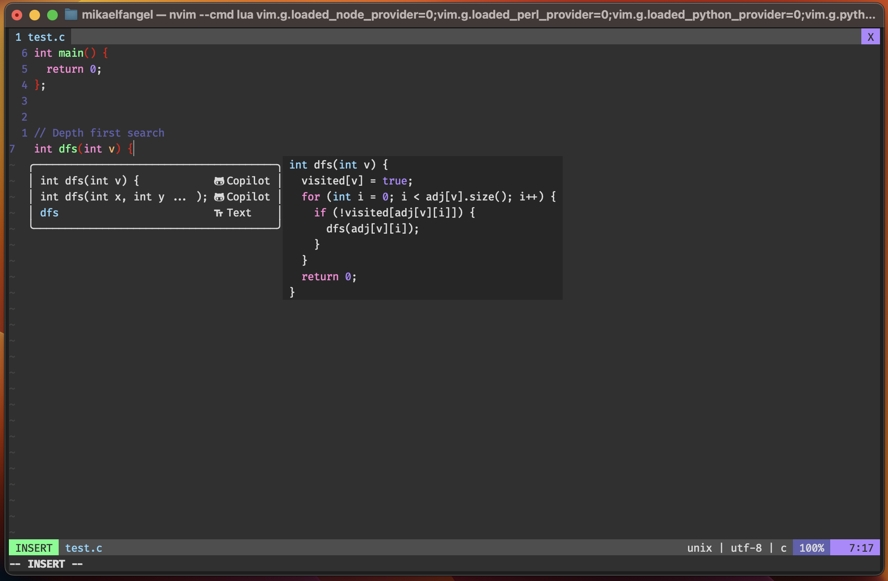
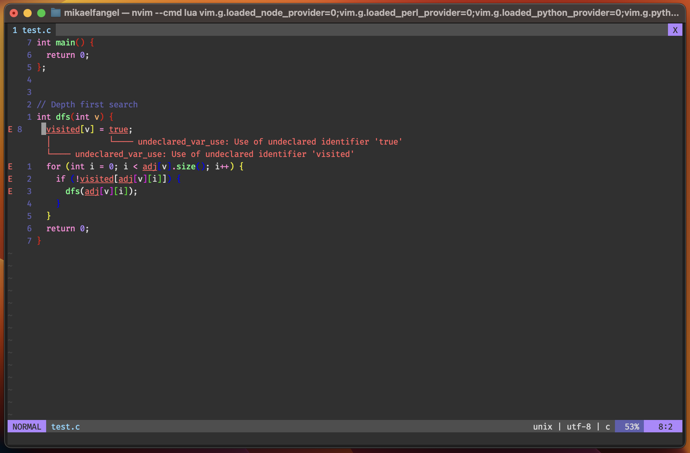

<p align="center">
  
</p>

<h1 align="center">NixVim Configuration</h1>
Because who doesn't like a declarative configuration of Neovim?


<details>
<summary>More Screenshots</summary>



</details>

## How to run

To run the configuration, you can type the following:

```bash
nix run github:mikaelfangel/nixvim-config
```

## How to include as package

To include the configuration as a replacement for Neovim, you first need to add it as an input on your system

```
inputs.nixvim.url = "github:mikaelfangel/nixvim-config"
```

Then you can input this in your configuration.nix (be sure that you inherit inputs from your flake)

```
  environment = {
    systemPackages = with pkgs; [
      inputs.nixvim.packages.${system}.default
    ];
  };
```

## Config and Plugins

Descriptions of all the config files/plugins used in this configuration.

| Name | Description |
| --- | --- |
| alpha.nix | Greeter/dashboard screen on startup with quick-action buttons. |
| auto-pairs.nix | Pairs brackets and quotes automatically. |
| autosave.nix | Saves changes to disk automatically. |
| blink-cmp.nix | Performant completion engine with LSP, path, snippet, buffer, and emoji sources. |
| blankline.nix | Indent guides with scope awareness. |
| bufferline.nix | Tab-like interface for easy buffer navigation. |
| codecompanion.nix | AI-powered coding assistant using a local Ollama server. |
| conform-nvim.nix | Lightweight yet powerful formatter with format-on-save. |
| default.nix | Default configuration file — imports all modules. |
| fidget.nix | Show LSP progress notifications in the bottom corner. |
| git.nix | Gitsigns — git decorations: signs for added, removed, and changed lines. |
| image.nix | Inline image rendering in markdown via kitty graphics protocol. Toggle with `<leader>ti`. |
| keymaps.nix | Global keymaps and leader key configuration. |
| lint.nix | Asynchronous linting via nvim-lint (e.g. statix for Nix). |
| lsp.nix | Language Server Protocol support (bash, C, Go, Nix, Python, Rust). |
| lualine.nix | Status line written in Lua. |
| noice.nix | Modern UI for messages, cmdline, and popupmenu. |
| notes.nix | Custom notes plugin — journal, wiki links, backlinks, templates, tasks, search, export. |
| nvim-tree.nix | File explorer tree sidebar. |
| oil.nix | Edit the filesystem like a buffer — replaces netrw. |
| options.nix | Neovim options and settings. |
| outline.nix | Document outline/symbols viewer. |
| telescope.nix | Extendable fuzzy finder over lists. |
| toggleterm.nix | Management of multiple terminal windows. |
| treesitter.nix | Syntax highlighting and indentation based on Tree-sitter. |
| trouble.nix | Pretty list for diagnostics, references, quickfix, and location lists. |
| which-key.nix | Popup display of keybindings. |

## Notes Plugin

This repository includes a custom Neovim plugin (`plugin/notes/`) for markdown-based note-taking, designed as a Logseq replacement.

### Directory structure

```
~/notes/
├── pages/       — regular pages (created via :NotesNew or [[wiki links]])
├── journal/     — daily journal entries (YYYY-MM-DD.md)
└── templates/   — template files with {{variable}} substitution
```

### Keymaps (`<leader>n` prefix)

| Key | Command | Description |
| --- | --- | --- |
| `<leader>nj` | `:NotesJournal` | Open today's journal (auto-creates from template) |
| `<leader>np` | `:NotesFind` | Find page (Telescope) |
| `<leader>nw` | `:NotesSearch` | Full-text search (Telescope live_grep) |
| `<leader>nt` | `:NotesTags` | Search for #tags |
| `<leader>nb` | `:NotesBacklinks` | Show backlinks to current page |
| `<leader>nd` | `:NotesToggleTask` | Toggle checkbox `- [ ]` ↔ `- [x]` |
| `<leader>nn` | `:NotesNew` | Create a new page |
| `<leader>nl` | `:NotesFollowLink` | Follow [[wiki link]] under cursor |
| `<leader>ni` | `:NotesTemplate` | Insert a template |
| `<leader>ne` | `:NotesExport` | Export to HTML/PDF via pandoc |
| `<leader>ng` | `:NotesGit` | Open LazyGit in notes directory |

### Completion

- Type `[[` in a notes buffer to autocomplete page names
- Type `/` at the start of a line for slash commands (`/todo`, `/done`, `/date`, `/time`, `/journal`, `/template`)

### Template variables

| Variable | Replaced with |
| --- | --- |
| `{{date}}` | Current date (YYYY-MM-DD) |
| `{{time}}` | Current time (HH:MM) |
| `{{weekday}}` | Day of the week |
| `{{title}}` / `{{page}}` | Current buffer's page name |
| `{{cursor}}` | Cursor position after insertion |

## Contributing

If there is something that you feel that is not quite right, or you have ideas for improvement, please submit an issue or a PR.

## Acknowledgements

* [NixVim](https://github.com/nix-community/nixvim)
